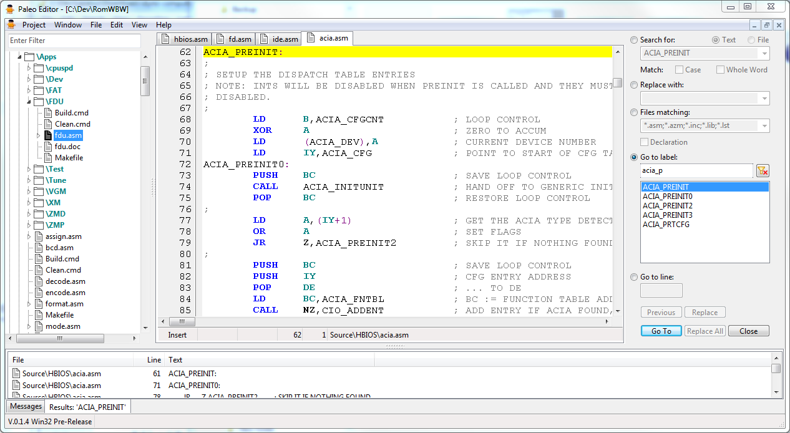

# Paleo Editor
Paleo Editor for RomWBW Development

The Paleo Editor is a source code editor designed specifically to help make modifying the [RomWBW](https://github.com/wwarthen/RomWBW) project easier. It does this by help managing all of the various files that are part of the RomWBW project.

The Paleo Editor provides the user with an hierarchical view of the files and folders of the RomWBW project. The user can choose which folders and types of files that are shown. Files opened in the editor are linked to the hierarchical view and the user can quickly switch from file to file.

## Features

* The Paleo Editor provides the user with an hierarchical view of the files and folders of the RomWBW project. Files opened in the editor are linked to the hierarchical view and the user can quickly switch from file to file.
* The Paleo Editor can open the RomWBW project in two modes. 
  1. The RomWBW project folder can be opened to allow editing all of the relevant files of the RomWBW project.
  2. A specific assembled listing file can be opened that allows all the source code files referenced by that listing file to be edited. This allows the user to concentrate only on these referenced source code files.
* Multiple projects can be opened simultaneously.
* The Paleo Editor supports syntax highlighting for files types:
  * BASIC
  * Config (.ini)
  * HTML (with preview)
  * JSON
  * Markdown (with preview)
  * Pascal
  * Spin
  * XML
  * Z80/Z180 Assembly
* The Paleo Editor supports viewing file types:
  * Image (Bitmap, Pixmap, PNG, JPEG, GIF, TIFF and Icon)
  * PDF
  * RichText
  * ZIP
* The Paleo Editor allows the execution of batch files (.bat, .cmd or .ps1). This allows the user to assembly the RomWBW project from the editor.
* The user is able to configure the following:
  * The folders that are excluded from the hierarchical view.
  * The file types (via the file extension) that are excluded from the hierarchical view.
  * The file types (via the file extension) that are text editable (i.e., non-binary).
  * The file types (via the file extension) are searchable.
  * The file types (via the file extension) are executable.
  * Restoration of previously opened files when opening a project.
  * The syntax highlighting used in the text editor.
* Non-text files can be modified via a hex editor.
* Files can be searched within the hierarchical view.
* Text can be searched forward and backward within a text file.
* Data can be searched forward within a binary file.
* Text can be searched across all specified file types (via the file extension).
* Label declarations can be search with a text file.
* Label declarations can be searched across all specified file types (via the file extension).
* Text files can be exported to HTML files.

## Known Issues

* Text cannot be pasted into the *Search for:* field on the find pane.
* The *Window* main menu option doesn't position correctly on the menu bar when a project is opened.
* Building the RomWBW project (via the src\Build.cmd batch file) doesn't complete successfully by the *File* | *Execute Command...* main menu option. (It does successfully completed by the *File* | *Launch Execute...* main menu option.)
* The Serial Terminal feature is only supported in 32-bit versions of the Paleo Editor.
* The transfer of files using XMODEM in the Serial Terminal is not working.

## Missing Features

* Online Help
* User Documentation
* Printing
* Check for Updates
* Built-in Assembler
* Build-in Simulator

## Installation

[Windows installers](https://github.com/alloidian/PaleoEditor/releases) are provided to install 32- or 64-bit Microsoft Windows version of the Paleo Editor.

The Paleo Editor can be installed for all users (which requires elevated access during installation) or only for the current user. Both the 32- and 64-bit version of the Paleo Editor may be installed side-by-side only on a 64-bit version of Windows and only for all users. (I can't think of a reason why both versions should be installed.)

The installers require Microsoft Windows Vista or later. 

## Building Instructions

The Paleo Editor project has only been designed to run on 32- and 64-bit versions of Microsoft Windows. At this time, there has been no effort to port the project to any other operating systems.

The Paleo Editor project was developed with the Microsoft Windows 64-bit version of the Lazarus IDE, version 2.2.2 (dated 2022-07-10) and compiled with the Free Pascal Compiler (FPC) version 3.2.2.

After the source code has been cloned or download from GitHub, additional, third-party software must be downloaded by running the following batch files:

* src\HtmlViewer\Install.bat
* src\MarkDown\Install.bat

In order to work with and compile the project, these tools need to be installed onto your computer. Note: compiling this project on platforms other than Microsoft Windows (i.e., Linux or Macintosh) has not been tested.

The Lazarus IDE (along with the Free Pascal Compiler) can be founded at [SourceForce](https://sourceforge.net/projects/lazarus/).

In addition to the Lazarus IDE, the Paleo Editor project used the third-party component library MPHexEditor. The package can be found at [GitHub](https://github.com/michalgw/mphexeditor).

This package must be installed into the Lazarus IDE. [Installation Instructions](https://wiki.freepascal.org/Install_Packages) are available.

Windows-based setup installers scripts have been prepared for Inno Setup by [JRSoftware](https://jrsoftware.org/isdl.php).

This compiler must be installed onto your Windows-based computer in order to build the Setup installer for both 32- and 64-bit version of the Paleo Editor.

